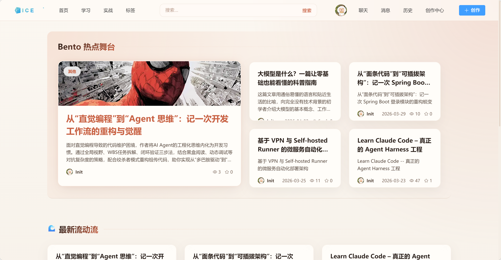
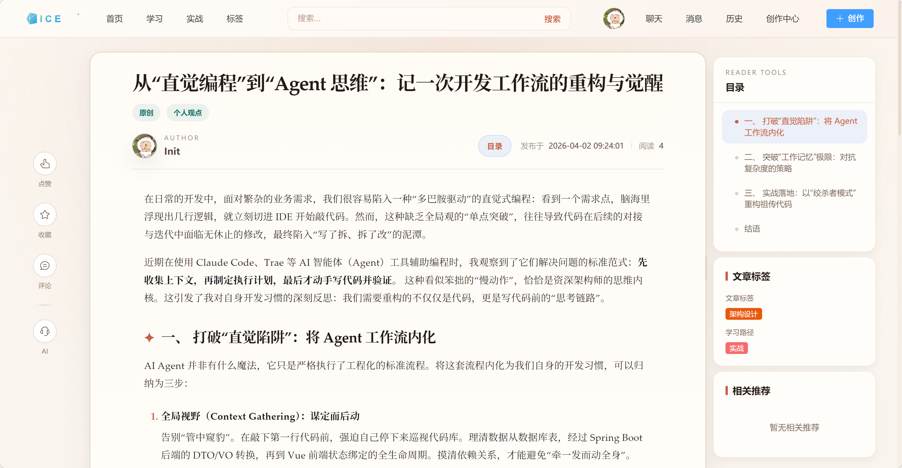
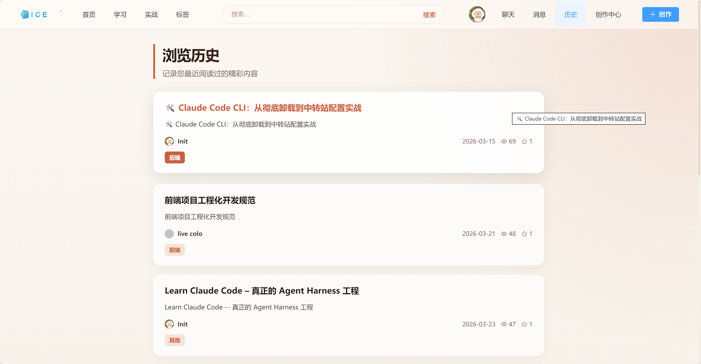
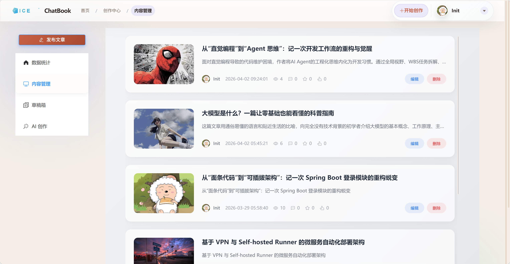
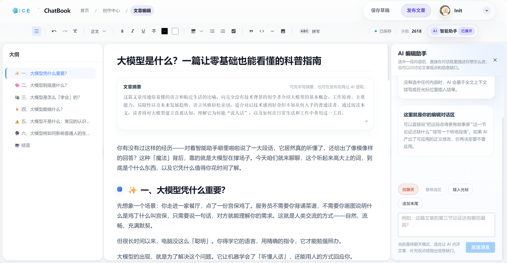
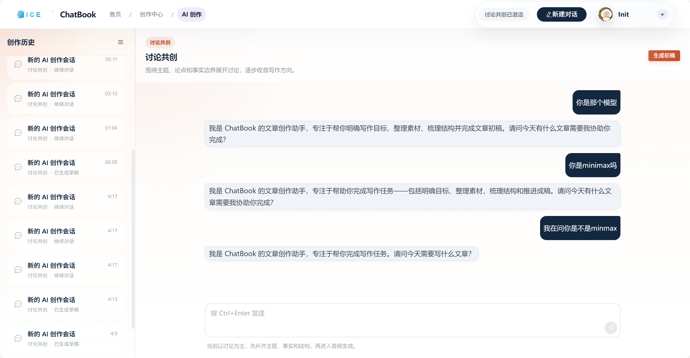
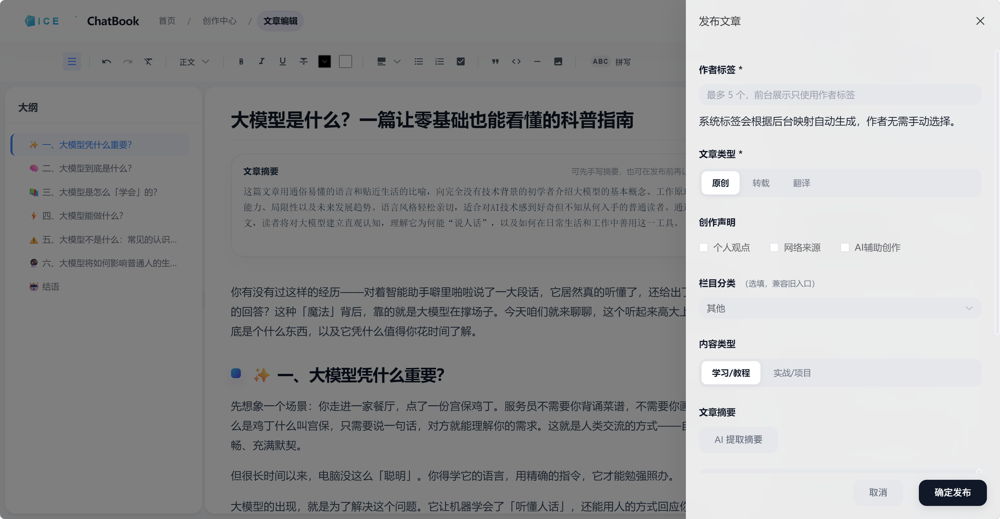
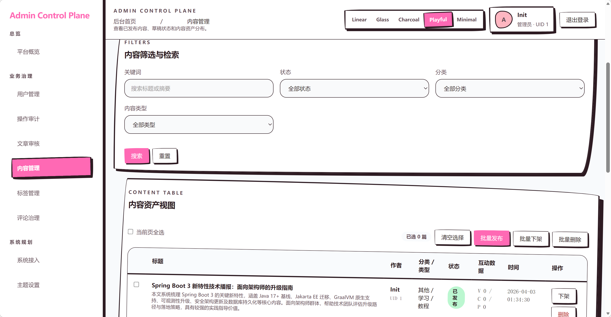
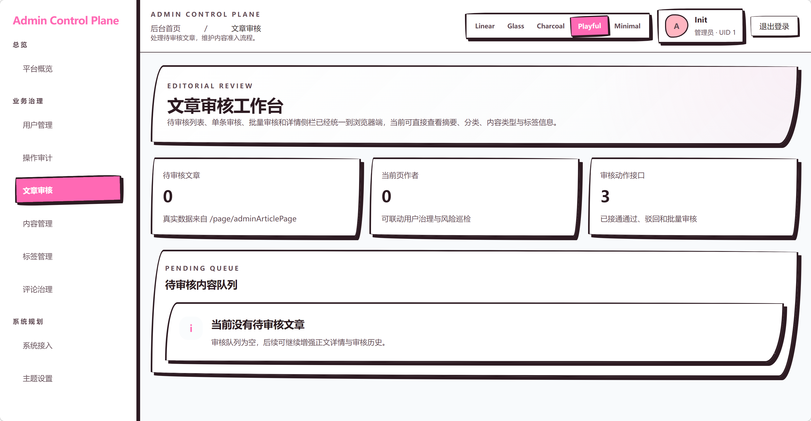
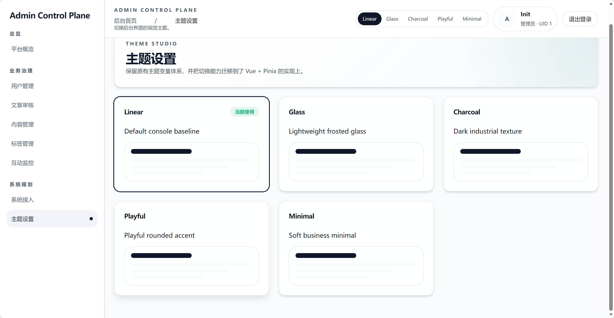

# Chat Book Cloud

[](https://spring.io/projects/spring-boot)
[](https://spring.io/projects/spring-cloud)
[](https://github.com/alibaba/spring-cloud-alibaba)
[](https://vuejs.org/)

`Chat Book Cloud` 是一个面向技术内容社区与 AI 辅助创作场景的微服务系统。本项目不仅仅是一个基础的博客站点，而是将 **“内容阅读、内容创作、AI 生文、内容治理”** 串联成一条完整链路的综合性内容平台。

系统包含面向读者的博客前台、面向作者的创作中心、面向内容生产的 AI 创作助手，以及面向运营与治理的后台管理端。

---

## 🌟 项目亮点（核心竞争力）

- **完整的业务链路闭环**：打通了“前台阅读 -> 用户互动 -> 作者创作 -> AI 辅助生成 -> 内容发布 -> 后台审核与治理”的全业务流程，具备极高的产品完成度。
- **AI 深度融入创作工作流**：AI 能力并非简单的“外挂聊天框”，而是深度嵌入创作链路中。支持交互式表单约束、首稿生成、草稿局部重写与多版本对比，基于流式输出（SSE）和 WebSocket 实现实时状态同步，让 AI 真正赋能内容生产。
- **清晰的微服务架构边界**：后端基于 Spring Cloud Alibaba 架构，将核心业务拆分为网关、认证、用户、文章、互动、社交、聊天、Agent 独立服务，并抽象了高度可复用的基础组件模块（Common、MyBatis、Redis、WebSocket、MinIO 等），工程化架构与可维护性极强。
- **强大的实时通信与治理体系**：兼顾传统 CRUD 场景与高并发实时协作场景（集成 WebSocket 与心跳重连）。后台管理端提供真实的内容审核链路、标签体系、用户角色管理、操作审计以及平台全量数据监控，内置基于 Vue+Pinia 构建的动态主题切换系统。

---

## 📸 核心功能与界面展示

### 1. 博客前台与社区互动
前台承担内容展示、内容消费和用户侧互动，支持多维度内容分发（最新、热门、推荐）、分类标签聚合、历史记录追踪以及实时私聊功能。

<details>
<summary><b>点击展开查看前台截图</b></summary>

**首页内容分发与卡片聚合**


**沉浸式文章阅读体验与辅助推荐**


**用户足迹与浏览历史**

</details>

### 2. 创作中心与 AI 创作工作流
创作中心引入独立的富文本编辑器（基于 Tiptap）与草稿版本体系。内置 AI 助手（Agent），涵盖“对话式澄清、一键生成首稿、改写优化”等闭环能力。

<details>
<summary><b>点击展开查看创作中心截图</b></summary>

**创作者内容资产管理**


**专业级富文本创作工作台**


**AI 会话生成与多版本创作协同**


**结构化内容发布与 AI 摘要提取**

</details>

### 3. 后台管理与系统治理
承担全站内容监控与管理职能，包含完整的文章上/下架流转、审核审批、标签与用户权限治理，以及独特的动态主题切换视觉系统。

<details>
<summary><b>点击展开查看后台治理截图</b></summary>

**全站内容全生命周期治理**


**文章人工审核与自动化标签匹配工作台**


**后台可视化主题设置与界面定制**

</details>

---

## 🛠️ 技术栈与总体架构

系统整体是一个“前后端分离 + 网关统一入口 + 多微服务协作”的架构。

```text
博客前台（Vue 3）        后台管理端（Vue 3 + TS）
        |                        |
        +----------- Gateway 统一入口 -----------+
                            |
    +---------+---------+---------+---------+---------+---------+---------+
    |         |         |         |         |         |         |         |
   Auth      User     Article  Interaction Social    Chat      Agent
    |         |         |         |         |         |         |
    +---------+---- MySQL / Redis / RabbitMQ / MinIO / Nacos ---+
```

- **统一网关入口**：Gateway 负责统一路由、鉴权前置和 Header 身份透传。
- **业务微服务化**：按领域模型细化拆分多个业务支撑模块，通过 Nacos 进行配置与服务发现。
- **前后端分离**：两套独立构建的前端项目（博客前台与后台管理端），针对不同受众提供针对性 UI 设计。
- **多端安全与实时通信**：基于 JWT + Refresh Token 刷新机制，支持 OAuth2（Google）第三方登录。内部服务依靠签名校验防伪造；集成 WebSocket 和 SSE 构建双通道实时交互机制。

### 后端架构
- **核心框架**：Java 17、Spring Boot 3.2.4、Spring Cloud 2023.0.1、Spring Cloud Alibaba
- **持久层**：MyBatis-Plus、MySQL 8
- **中间件与基础设施**：Redis（缓存与分布式锁）、RabbitMQ（异步消息解耦）、MinIO（对象存储）、Nacos（服务注册与配置中心）
- **AI 集成框架**：Anthropic 兼容大模型接口、LangChain4j、流式会话引擎

### 前端架构
- **核心框架**：Vue 3、Vite
- **UI 组件与样式**：Element Plus、Tailwind CSS 4
- **状态管理**：Pinia
- **富文本引擎**：Tiptap

---

## 📂 仓库与模块结构

```text
chat-book-cloud
├─ chat-book-cloud-dependencies        # Maven BOM，统一第三方依赖版本管理
├─ chat-book-cloud-framework           # 内部公共基础组件聚合模块
│  ├─ chat-book-cloud-common           # 全局工具类、常量与异常处理
│  ├─ chat-book-cloud-mybatis          # ORM 层公共配置与分页封装
│  ├─ chat-book-cloud-redis            # 缓存与锁统一配置
│  ├─ chat-book-cloud-websocket        # WebSocket 连接池与鉴权封装
│  ├─ chat-book-cloud-security-mvc     # Web MVC 与权限拦截过滤器
│  ├─ chat-book-cloud-minio            # 对象存储集成封装
│  └─ chat-book-cloud-rabbitmq         # 消息队列基础集成
├─ chat-book-cloud-gateway             # Gateway API 网关服务
├─ chat-book-cloud-auth                # 统一认证服务 (JWT, OAuth2)
├─ chat-book-cloud-agent               # Agent 智能创作与会话服务
├─ chat-book-cloud-article             # 文章、草稿与标签核心服务
├─ chat-book-cloud-user                # 用户资料与权限体系服务
├─ chat-book-cloud-interaction         # 点赞、收藏、评论互动系统
├─ chat-book-cloud-social              # 关注、粉丝等轻社交服务
├─ chat-book-cloud-chat                # 聊天室与实时消息下发服务
├─ chat-book-cloud-api                 # OpenFeign API 接口统一聚合模块
├─ chat-book-ui-blog                   # 博客前台 (面向内容创作者与读者)
├─ chat-book-ui-admin                  # 后台管理端 (面向平台运营与审核人员)
├─ docker-compose.yml                  # 本地全量中间件与服务快速编排环境
└─ docker-compose.dev.yml              # 服务器协同开发与测试环境编排文件
```

---

## 🚀 服务分布与默认端口映射

| 模块名称 | 服务标识 | 默认端口 | 职责说明 |
| --- | --- | --- | --- |
| **Gateway** | `chat-book-cloud-gateway` | `8080` | 全局统一 API 入口与请求路由转发 |
| **Auth** | `chat-book-cloud-auth` | `8081` | 用户注册登录、令牌颁发验证、OAuth2 接入 |
| **Article** | `chat-book-cloud-article` | `8082` | 文章内容检索、标签与静态资源管理 |
| **User** | `chat-book-cloud-user` | `8083` | 用户基础信息维护、后台用户治理管控 |
| **Interaction**| `chat-book-cloud-interaction` | `8084` | 互动行为记录 (点赞、收藏、评论) 与系统通知 |
| **Chat** | `chat-book-cloud-chat` | `8085` | 实时私聊系统与全站消息分发 |
| **Social** | `chat-book-cloud-social` | `8086` | 用户关系图谱 (关注、取关、好友判定) |
| **Agent** | `chat-book-cloud-agent` | `8087` | 大模型会话网关与内容生成引擎桥接 |
| **Blog UI** | `chat-book-ui-blog` | `5173` (开发) / `80` (容器) | 前台业务 Web 客户端 |
| **Admin UI**| `chat-book-ui-admin` | `3001` (开发) / `3000` (容器) | 后台治理 Web 客户端 |

> Gateway 已配置 `/api/{service}/**` 前缀路由及 `/api/article/ws`、`/api/chat/ws` 等 WebSocket 代理。

---

## 📦 快速启动与部署指南

### 1. 运行环境依赖
本地环境至少需准备：`JDK 17+`、`Maven 3.8+`、`Node.js 18+` (CI 环境推荐 Node 24)、`MySQL 8`、`Redis 7`、`Nacos 2.x`。
按需启用完整功能时还需：`RabbitMQ`、`MinIO`、Google OAuth2 凭证以及 Agent 模型接口 Key。

### 2. 数据库初始化
目前通过服务自动建表（或交由 CI 触发）。若本地直接启动，请先手动创建以下 Schema：
```sql
CREATE DATABASE IF NOT EXISTS chat_book_user;
CREATE DATABASE IF NOT EXISTS chat_book_article;
CREATE DATABASE IF NOT EXISTS chat_book_interaction;
CREATE DATABASE IF NOT EXISTS chat_book_social;
CREATE DATABASE IF NOT EXISTS chat_book_chat;
CREATE DATABASE IF NOT EXISTS chat_book_agent;
```

### 3. Nacos 环境配置加载
各微服务通过 `bootstrap.yaml` 声明服务名，依靠 `spring.config.import` 机制自动从 Nacos 拉取对应环境的公共配置（例如 Data ID: `agent-service-local.yml`）。
> *注：如无需 Nacos，须在本地自行填补各模块的完整 application 配置。*

### 4. 后端服务启动顺序推荐
1. 基础中间件 (MySQL, Redis, Nacos, MinIO, RabbitMQ)
2. `chat-book-cloud-gateway`
3. `chat-book-cloud-auth` / `chat-book-cloud-user`
4. 其余业务线微服务及 Agent
*支持根目录下直接执行 `mvn clean package` 编译全部模块。*

### 5. 前端应用启动
**博客前台：**
```bash
cd chat-book-ui-blog
npm install
npm run dev
```

**后台管理：**
```bash
cd chat-book-ui-admin
npm install
npm run dev
```

### 6. Docker Compose 一键编排部署
仓库根目录包含开箱即用的容器编排能力，启动涵盖全部微服务与中间件：
```bash
cp .env.example .env
# 请根据实际情况修改 .env 中的账号、密码、密钥和访问凭据
docker compose --env-file .env -f docker-compose.yml up -d --build
```

---

## 🔄 CI/CD 自动化工作流

项目内部已构建标准的 GitHub Actions 流水线，保证集成与交付质量：
1. **持续集成 (CI)**：发起 PR 到 `master` 时触发。脚本自动拉起 MySQL/Redis 等镜像、建立测试库、执行全量 `mvn test` 并预构建双端 Vue 应用。
2. **测试环境部署 (Deploy Dev)**：针对 `master` 分支 push 或手动触发。自动分析代码变更范围，仅重构受影响模块镜像，最后由 `docker-compose.dev.yml` 执行热更新部署。
